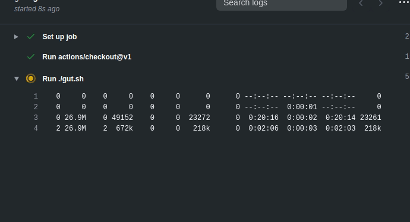

# godot-ci-template

## What is this repo?
This is a bare-ish Godot project with
[Gut](https://github.com/bitwes/Gut) and [Pre-commit](https://pre-commit.com/)
pre-installed as [GitHub Workflows](https://docs.github.com/en/actions/reference/workflow-syntax-for-github-actions).

This gives Godot devs out-of-the-box CI for their game projects

## How do I use it?
1. Log into GitHub.
2. Make a repo from the template [here](https://github.com/jason-h-35/godot-ci-template/generate).
3. Make commits as usual.
4. Add tests to `tests/unit` or `tests/integration`. Only filenames starting with `test_` get tested!
5. When `master` gets a commit or a PR, the CI will just werk!

## Optional
* Modify `.pre-commit-config.yml` and comment out pre-commit hooks you don't want to run.
* Modify `.gutconfig.json` to change how gut runs.
* Modify the `GODOT_VERSION` env_var in `.gut.sh` to match your preferred version of Godot.
* Modify the build status images at the top of this README to point to your build status instead of the template's
